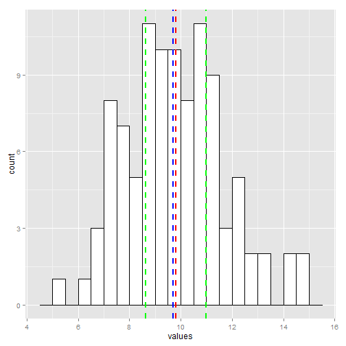

### This app will produce a user defined amount of random numbers, plot their values and give numeric definitions of the:  
  
### 1. Mean  
### 2. Median  
### 3. Lower interquartile  
### 4. Upper interquartile  
### 5. Interquartile range  
### 6. Standard deviation  

---

### Example:  

### If 100 random values are generated with a mean of ~10 and a standard deviation of ~2 Then the following outputs could be displayed  


```
## [1] "Mean = 10.12"
```

```
## [1] "Median = 10.09"
```

```
## [1] "Lower quartile value = 9.02"
```

```
## [1] "Upper quartile value = 11.58"
```

```
## [1] "Interquartile range = 2.56"
```

```
## [1] "Standard deviation = 2.12"
```

---

### The accompanying plot will also show the values marked as vertical lines


```
## Loading required package: ggplot2
```

 
